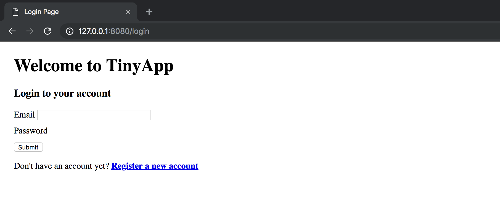
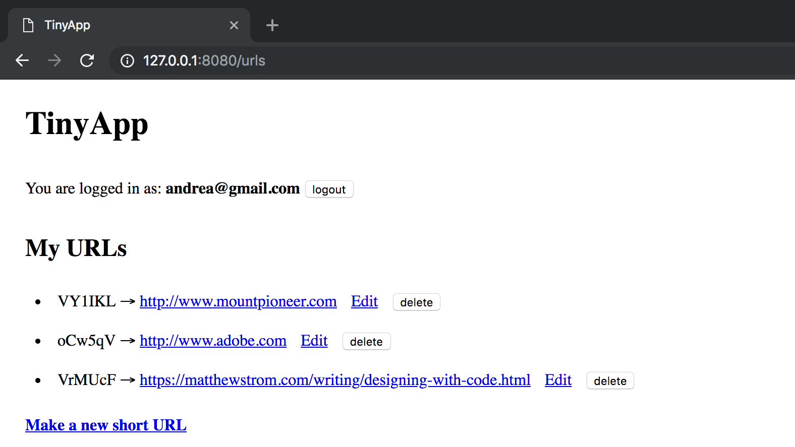
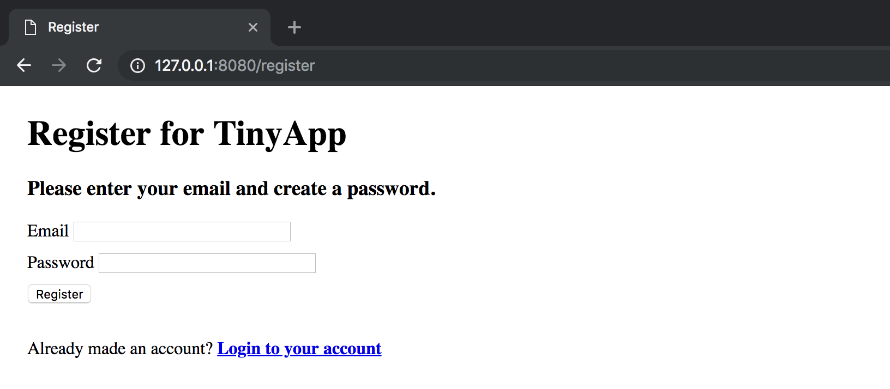
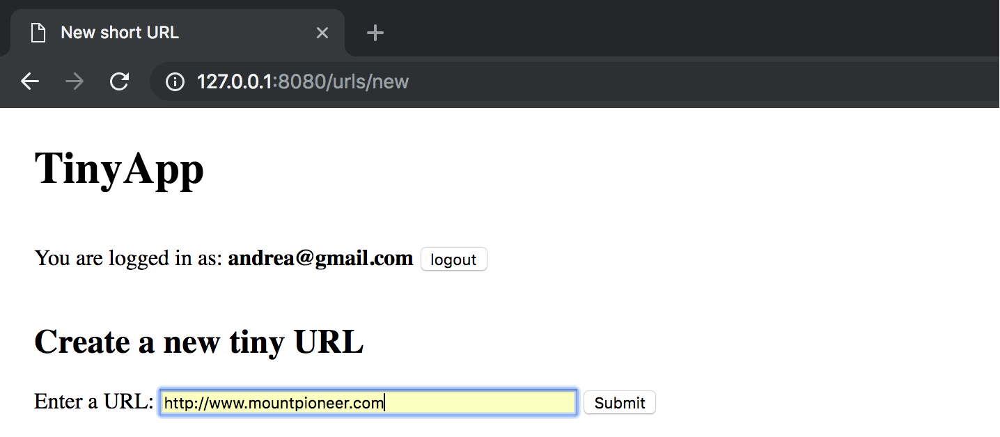

# TinyApp
TinyApp is a full stack web application built with Node and Express that allows users to create a short url code that will link to a longer url. The user can create and save a database of short urls that can be edited and deleted. The short urls are sharable and can be used by anyone.

## Final Product

-------------------------------------

-------------------------------------

-------------------------------------

-------------------------------------

## Dependencies
* Node.js
* Express
* EJS
* bcrypt
* body-parser
* cookie-session

## Getting Started

* Install all dependencies using the `npm install` command.
* Run the development web server using `node express-server.js` command.

